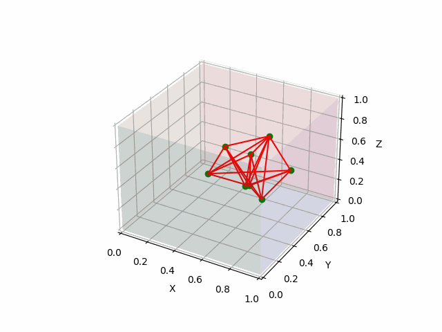

# Симуляция тканей при помощи PBD

***Position Based Dynamics*** как метод основывается на описании и поддержании "ограничений" системы

Идея:
- Вместо физических сил симулируем "ограничения" системы.
- Каждое ограничение представляет из себя некоторое уравнение. Для точек это может быть расстояние, для точки и объекта это может быть "не находиться внутри объекта", что корректируется в пересечение нескольких уравнений.

Решение такой системы нетривиально и вычисляется очень долго. Более реалистичным подходом будет начать решать констрейны по-очереди.

Так, имея точки $A$ и $B$ с ограничениями на расстояние $l$ между ними, решением будет:

$A \mathrel{+}= |A-B|/2l * (B-A)$

$B \mathrel{+}= |A-B|/2l * (A-B)$

Очевидно что одна итерация такого алгоритма будет ассиметрична относительна порядка и первые констрейны могут быть сильно нарушены к концу решений. Для этого предлагается проделать несколько итераций. Более того, количество итераций в явном виде определяет то, на сколько тело выглядит "мягким" и "тряпичным" (большое количество итераций делают систему более жёской, приближенной к твёрдому телу из точек)

Просто решения ограничений недостаточно. Столкновения, полученные таким образом не упруги, и без дампинга отсутствует трение. Более реалистичный подход представлен в [(статье)](https://matthias-research.github.io/pages/publications/posBasedDyn.pdf), ниже дан предложенный для симуляции алгоритм.

```
forall vertices i
  initialize xi = x, vi = v
endfor
loop
  forall vertices i do vi ← vi + ∆twifext(xi)
  dampVelocities(v1,...,vN)
  forall vertices i do pi ← xi + ∆tvi
  forall vertices i do generateCollisionConstraints(xi → pi)
  loop solverIterations times
    projectConstraints(C1,..., CM+Mcoll , p1, ..., pN)
  endloop
  forall vertices i
    vi ← (pi −xi)/∆t
    xi ← pi
  endfor
  velocityUpdate(v1,...,vN)
endloop
```

В данном методе перед Полу-Эйлером применяется некоторый солвер констрайнов - метод который итерирует через все ограничения и наивно их разрешает. 
После нескольких итераций управление передаётся Полу-Эйлеру, и, в самом конце, вызывается *velocityUpdate*, который модифицирует вектор скоростей
на основе информации из солвера констрейнов (в статье предлагается добавлять упругий отскок для материальных точек применяя дампинг к вектору скоростей и отражая его по нормали каждого столкновения)

Выполняя только Полу-Эйлера с солвером можно получить модель которая будет симулировать столкновения и жёсткие расстояния, однако, без дампинга и обновления скоростей система может расходиться. 
Например констрейн колизии с полом без дампинга может привести к вращению, так как у нас нет упругово столкновения или трения:


С этим можно бороться применяя дампинг (как в статье сразу после расчёта новых скоростей)


Такой подход позволяет описать как расстояние между частицами (которое мы используме для симуляции поверхностей и тел), так и колижены, в явном
виде указав что частица не должна находиться внутри тела и в случае проникновения - проецировалась на поверхность.

Добавление дампинга и отражения вектора скорости точки при колижине позваляет делать более упругие взаимодействия


